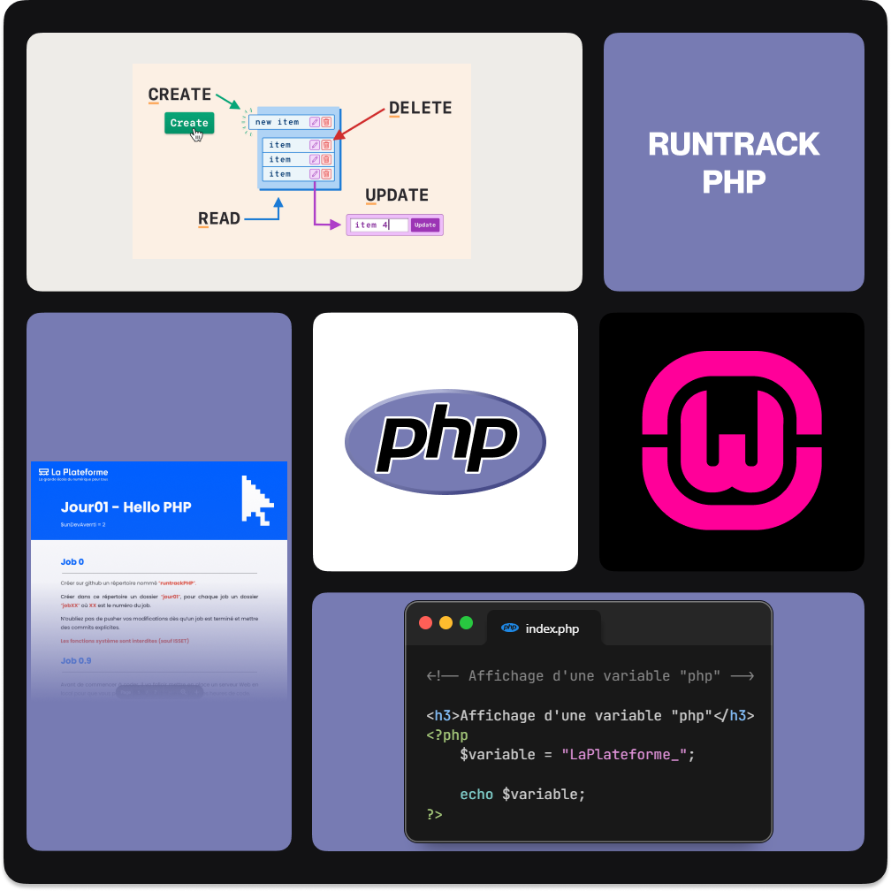

# Projet PHP

Ce projet est une découverte de PHP
Ce projet contient des fichiers PHP qui réalisent différentes exercice selon réalisées a l'école dIt de la Plateforme_ .

## Structure du Projet

Le projet est réalisées sur une durée de cinq jours. Qui sont divisé en différentes parties, chaque partie correspondant à un "Job" spécifique, tel que défini dans les spécifications.

## Ce que j'ai appris

- **Jour 1**: Apprentissage des bases de PHP en créant des variables, des fonctions et des conditions, tout en configurant un environnement de développement local avec WAMPserver.
- **Jour 2**: Apprentisage de la manipulation d'un formulaires en php grâce aux superglobales $_GET et $_POST. Découverte de notion de “paramètres” dans une URL et création d'algorithmes.

## Contenu

- **index.php**: Fichier principal qui contient les différentes exercice des différentes job demandée.

## 🔗 Links
